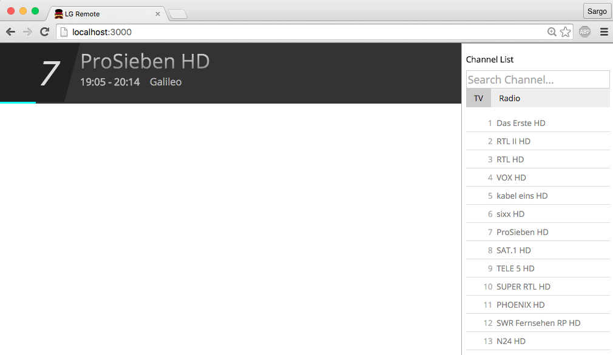

# WebOS Remote

HTML/JS/WebSocket based remote for LG TVs using WebOS. 
No more girlfriend asking for the remote ;)

## Getting started

To get the remote to run, install it via npm.

    npm i -g webos-remote 

After you've installed it you can start the remote server with

    TV_IP=xxx.xxx.xxx.xxx webos-remote

Alternatively you can specify TV_IP in your .bash_profile. 

If you fancy it, get a small raspberry pi, hook it up on the network
and let this run as a service so your remote is available from
everywhere in your home and on your mobile. 

## Caveats

Right now you have to enter a IP at the beginning. This might be improved
with usage of the dgram library and broadcasting a packet to which the
TV responds.

Currently you need to have a node server to proxy the requests as WebOS
checks for the origin and seems to reject it if it doesn't come from
node for some reason so there is a WebSocket Proxy running in the back.

A new websocket connection to the TV is created every time a client opens
the website. This might be reduced to a single connection.

This is currently not responsive as this was hacked together in about 6 hours
so chances are it doesn't look right on mobile devices or small screens.  

## License

Copyright (c) 2015 Daniel Klingmann <info@sargodarya.de>

Permission is hereby granted, free of charge, to any person obtaining a copy
of this software and associated documentation files (the "Software"), to deal
in the Software without restriction, including without limitation the rights
to use, copy, modify, merge, publish, distribute, sublicense, and/or sell
copies of the Software, and to permit persons to whom the Software is
furnished to do so, subject to the following conditions:

The above copyright notice and this permission notice shall be included in
all copies or substantial portions of the Software.

THE SOFTWARE IS PROVIDED "AS IS", WITHOUT WARRANTY OF ANY KIND, EXPRESS OR
IMPLIED, INCLUDING BUT NOT LIMITED TO THE WARRANTIES OF MERCHANTABILITY,
FITNESS FOR A PARTICULAR PURPOSE AND NONINFRINGEMENT.  IN NO EVENT SHALL THE
AUTHORS OR COPYRIGHT HOLDERS BE LIABLE FOR ANY CLAIM, DAMAGES OR OTHER
LIABILITY, WHETHER IN AN ACTION OF CONTRACT, TORT OR OTHERWISE, ARISING FROM,
OUT OF OR IN CONNECTION WITH THE SOFTWARE OR THE USE OR OTHER DEALINGS IN
THE SOFTWARE.